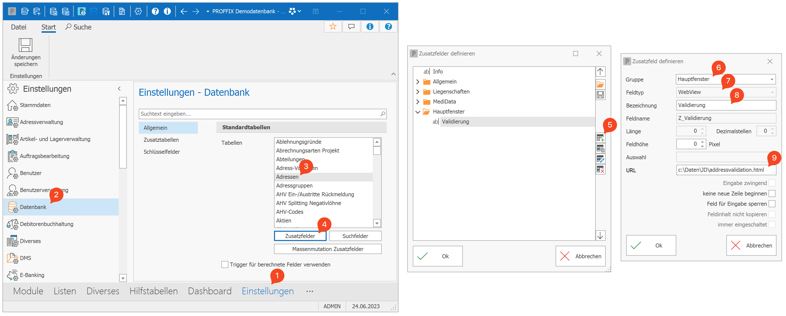

Address Validation Add-In
=========================

Proffix Px5 Add-In zur Validierung von Adressen über die Post Digital Commerce Address API.


Anforderungen
-------------

Alle Stellen im Sourcecode, an denen etwas für die Erfüllung der Aufgabe gemacht werden muss, sind mit einem "TODO-Kommentar" markiert.
Das Px5 Add-in soll folgende Anforderungen erfüllen:
1. Beim Öffnen oder Ändern der Adresse soll diese über die Post Digital Commerce Address API validiert werden.
   1. Für die Validierung werden folgende Felder verwendet: Vorname, Nachname, Strasse, Strassennummer, Postleitzahl, Ort
   2. Nur bei Änderungen in den überwachten Feldern, soll eine erneute Validierung durchgeführt werden
2. Sofern die Quality "FIXED" von der API zurückmeldet wird, soll die Adresse vom User aktualisiert werden können
   1. Nach der Übername des Vorschlags sollen die Felder gesperrt (disabled) werden.
   2. Über eine zweite Schaltfläche soll das Px5-Fenster geschlossen und der Adressdatensatz gespeichert werden können


Inbetriebname der lokalen Entwicklungumgebung
---------------------------------------------

### 1. Aktuelle Version von Proffix Px5 mit Demodatenbank lokal installieren
Die aktuelle Version kann unter heruntergeladen werden unter https://www.proffix.ch/download

### 2. Lokales Debugging und laden lokaler Files in der WebView aktivieren
Folgenden Schlüssel in der Windows Registrierung anlegen (_PxAddInEnableLocalDebugging.reg_):
```
[HKEY_CURRENT_USER\Software\Policies\Microsoft\Edge\WebView2\AdditionalBrowserArguments]
"*"="--remote-debugging-port=9222 --disable-web-security"
```

### 3. Debug-Konfiguration in VisualStudio Code anlegen
Folgende Debug-Konfiguration zu _launch.json_ hinzufügen:
```json
{
   "name": "Attach to Px5",
   "type": "msedge",
   "port": 9222,
   "request": "attach",
   "useWebView": true
}
```

### 4. Add-in zu Px5 hinzufügen
Neues Zusatzfeld in Px5 auf der Tabelle _Adresse_ hinzufügen:

- **Schritte 1 - 5:** Neues Zusatzfeld zur Tabelle _Adressen_ in Px5 hinzufügen
- **Schritt 6:** Gruppe _Hauptfenster_ auswählen, damit das Add-in neben den Adressfeldern dargestellt wird
- **Schritt 7:** Feldtyp _WebView_ auswählen
- **Schritt 8:** Frei wählbare Bezeichnung für das Zusatzfeld eingeben
- **Schritt 9:** Lokaler Pfad zur HTML-Datei (kann über lokalen Webserver erfolgen)

Hilfestellungen
---------------
- [Dokumentation Px5AddInConnector](https://px5addinconnector.proffix.app/1/docs)
- [Px5 Add-in Simulator](https://px5addinconnector.proffix.app/1/)
- [Dokumentation Post Digital Commerce Address API](https://developer.post.ch/en/digital-commerce-api) (wir verwenden den Endpunkt unter Kapitel 5.1)